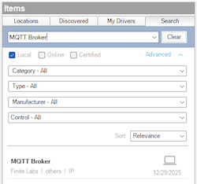

------------------------------------------------------------------------

# Overview

> DISCLAIMER: This software is neither affiliated with nor endorsed by
> either Control4 or MQTT.

The MQTT Broker driver connects Control4 to an MQTT broker (such as
Mosquitto, HiveMQ, or other MQTT-compatible platforms). It manages the
connection and provides pub/sub services to child drivers (switch,
button, contact, etc.) that connect via the MQTT broker connection
binding.

# Index

- [System Requirements](#system-requirements)
- [Features](#features)
- [Installer Setup](#installer-setup)
  - [Driver Installation](#driver-installation)
  - [Driver Setup](#driver-setup)
    - [Driver Properties](#driver-properties)
      - [Cloud Settings](#cloud-settings)
      - [Driver Settings](#driver-settings)
      - [MQTT Settings](#mqtt-settings)
  - [Driver Actions](#driver-actions)
- [Support](#support)
- [Changelog](#changelog)

# System Requirements

- Control4 OS 3.3+
- An MQTT broker accessible on the local network

# Features

- Local network communication requiring no cloud services
- Connects to any standard MQTT broker
- Supports username/password authentication
- Manages subscriptions for connected child drivers
- Automatic reconnection on disconnect
- Message caching for late-subscribing devices

# Installer Setup

## Driver Installation

Driver installation and setup are similar to most other ip-based
drivers. Below is an outline of the basic steps for your convenience.

1.  Download the latest `control4-mqtt.zip` from
    [Github](https://github.com/finitelabs/control4-mqtt/releases/latest).

2.  Extract and
    [install]((https://www.control4.com/help/c4/software/cpro/dealer-composer-help/content/composerpro_userguide/adding_drivers_manually.htm))
    the `mqtt_broker.c4z` and `mqtt_universal.c4z` drivers.

3.  Use the "Search" tab to find the "MQTT Broker" driver and add it to
    your project.

    > ⚠️ A ***single*** broker driver instance is required per broker
    > you wish to connect to.

    

4.  Configure the [Device Settings](#device-settings) with the
    connection information.

5.  After a few moments the [`Driver Status`](#driver-status-read-only)
    will display `Connected`. If the driver fails to connect, set the
    [`Log Mode`](#log-mode--off--print--log--print-and-log-) property to
    `Print` and run action [`Reconnect`](#reconnect) from the actions
    tab. Then check the lua output window for more information.

## Driver Setup

### Driver Properties

#### Cloud Settings

##### Automatic Updates

Turns on/off the GitHub cloud automatic updates.

##### Update Channel

Sets the update channel for which releases are considered during an
automatic update from the GitHub repo releases.

#### Driver Settings

##### Driver Status (read-only)

Displays the current status of the driver.

##### Driver Version (read-only)

Displays the current version of the driver.

##### Log Level \[ Fatal \| Error \| Warning \| ***Info*** \| Debug \| Trace \| Ultra \]

Sets the logging level. Default is `Info`.

##### Log Mode \[ ***Off*** \| Print \| Log \| Print and Log \]

Sets the logging mode. Default is `Off`.

#### MQTT Settings

##### Broker Address

Sets the broker IP address (e.g. `192.168.1.30`). Domain names are
allowed as long as they can be resolved to an accessible IP address by
the controller. HTTPS is not supported.

> ⚠️ If you are using an IP address, you should ensure it will not
> change by assigning a static IP or creating a DHCP reservation.

##### Port

Sets the broker port. The default port for most brokers is `1883`.

##### Username

Sets the username for broker authentication (optional).

##### Password

Sets the password for broker authentication (optional).

##### Keep Alive

Sets the keep-alive interval in seconds. Default is `60`.

#### Driver Actions

##### Reconnect

Manually trigger a reconnection to the MQTT broker.

##### Update Drivers

Trigger all MQTT drivers to update from the latest release on GitHub,
regardless of the current version.

# Support

If you have any questions or issues integrating this driver with
Control4, you can file an issue on GitHub:

<https://github.com/finitelabs/control4-mqtt/issues/new>

# Changelog

## v20260117 - 2026-01-17

### Added

- Added the MQTT Universal driver for managing multiple MQTT devices
  from a single driver instance. Supports relays, contacts, buttons,
  variables, and sensors with features including:
  - Keypad button linking for MQTT buttons
  - Device availability conditionals and events
  - State variables for relay and contact items
  - JSONPath value extraction for complex JSON payloads
- Added "Broker Connected" conditional and events to the MQTT Broker
  driver.

### Deprecated

- Deprecated the MQTT Switch, MQTT Contact, and MQTT Button drivers. Use
  MQTT Universal instead. This is the terminal release for these
  drivers.

## v20251229 - 2025-12-29

### Added

- Initial Release
