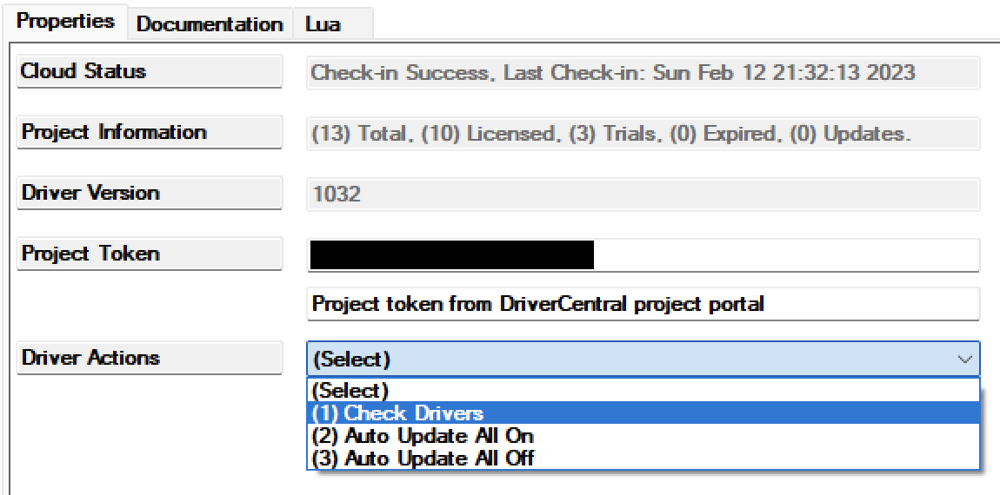

[copyright]: # "Copyright 2026 Finite Labs, LLC. All rights reserved."

---

# Overview

<!-- #ifndef DRIVERCENTRAL -->

> DISCLAIMER: This software is neither affiliated with nor endorsed by either
> Control4 or MQTT.

<!-- #endif -->

The MQTT Broker driver connects Control4 to an MQTT broker (such as Mosquitto,
HiveMQ, or other MQTT-compatible platforms). It manages the connection and
provides pub/sub services to child drivers (switch, button, contact, etc.) that
connect via the MQTT broker connection binding.

# Index

- [System Requirements](#system-requirements)
- [Features](#features)
- [Installer Setup](#installer-setup)
  <!-- #ifdef DRIVERCENTRAL -->
  - [DriverCentral Cloud Setup](#drivercentral-cloud-setup)
  <!-- #endif -->
  - [Driver Installation](#driver-installation)
  - [Driver Setup](#driver-setup)
    - [Driver Properties](#driver-properties)
      - [Cloud Settings](#cloud-settings)
      - [Driver Settings](#driver-settings)
      - [MQTT Settings](#mqtt-settings)
  - [Driver Actions](#driver-actions)
  - [Programming](#programming)
  <!-- #ifdef DRIVERCENTRAL -->
- [Developer Information](#developer-information)
<!-- #endif -->
- [Support](#support)
- [Changelog](#changelog)

# System Requirements

- Control4 OS 3.3+
- An MQTT broker accessible on the local network

# Features

- Local network communication requiring no cloud services
- Connects to any standard MQTT broker
- Supports username/password authentication
- Manages subscriptions for connected child drivers
- Automatic reconnection on disconnect
- Message caching for late-subscribing devices

# Installer Setup

<!-- #ifdef DRIVERCENTRAL -->

## DriverCentral Cloud Setup

> If you already have the
> [DriverCentral Cloud driver](https://drivercentral.io/platforms/control4-drivers/utility/drivercentral-cloud-driver/)
> installed in your project you can continue to
> [Driver Installation](#driver-installation).

This driver relies on the DriverCentral Cloud driver to manage licensing and
automatic updates. If you are new to using DriverCentral you can refer to their
[Cloud Driver](https://help.drivercentral.io/407519-Cloud-Driver) documentation
for setting it up.

<!-- #endif -->

## Driver Installation

Driver installation and setup are similar to most other ip-based drivers. Below
is an outline of the basic steps for your convenience.

<!-- #ifdef DRIVERCENTRAL -->

1. Download the latest `control4-mqtt.zip` from
   [DriverCentral](https://drivercentral.io/platforms/control4-drivers/utility/mqtt).
2. Extract and
   [install](<(https://www.control4.com/help/c4/software/cpro/dealer-composer-help/content/composerpro_userguide/adding_drivers_manually.htm)>)
   the `mqtt_broker.c4z` and `mqtt_universal.c4z` drivers.
3. Use the "Search" tab to find the "MQTT Broker" driver and add it to your
   project.

   > ⚠️ A **_single_** broker driver instance is required per broker you wish to
   > connect to.

   

4. Select the newly added driver in the "System Design" tab. You will notice
   that the `Cloud Status` reflects the license state. If you have purchased a
   license it will show `License Activated`, otherwise `Trial Running` and
   remaining trial duration.
5. You can refresh license status by selecting the "DriverCentral Cloud" driver
   in the "System Design" tab and perform the "Check Drivers" action.
    
6. Configure the [Device Settings](#device-settings) with the connection
   information.
7. After a few moments the [`Driver Status`](#driver-status-read-only) will
   display `Connected`. If the driver fails to connect, set the
   [`Log Mode`](#log-mode--off--print--log--print-and-log-) property to `Print`
   and run action [`Reconnect`](#reconnect) from the actions tab. Then check the
   lua output window for more information.

<!-- #else -->

1. Download the latest `control4-mqtt.zip` from
   [Github](https://github.com/finitelabs/control4-mqtt/releases/latest).
2. Extract and
   [install](<(https://www.control4.com/help/c4/software/cpro/dealer-composer-help/content/composerpro_userguide/adding_drivers_manually.htm)>)
   the `mqtt_broker.c4z` and `mqtt_universal.c4z` drivers.
3. Use the "Search" tab to find the "MQTT Broker" driver and add it to your
   project.

   > ⚠️ A **_single_** broker driver instance is required per broker you wish to
   > connect to.

   

4. Configure the [Device Settings](#device-settings) with the connection
   information.
5. After a few moments the [`Driver Status`](#driver-status-read-only) will
   display `Connected`. If the driver fails to connect, set the
   [`Log Mode`](#log-mode--off--print--log--print-and-log-) property to `Print`
   and run action [`Reconnect`](#reconnect) from the actions tab. Then check the
   lua output window for more information.

<!-- #endif -->

## Driver Setup

### Driver Properties

#### Cloud Settings

<!-- #ifdef DRIVERCENTRAL -->

##### Cloud Status

Displays the DriverCentral cloud license status.

<!-- #endif -->

##### Automatic Updates

<!-- #ifdef DRIVERCENTRAL -->

Turns on/off the DriverCentral cloud automatic updates.

<!-- #else -->

Turns on/off the GitHub cloud automatic updates.

##### Update Channel

Sets the update channel for which releases are considered during an automatic
update from the GitHub repo releases.

<!-- #endif -->

#### Driver Settings

##### Driver Status (read-only)

Displays the current status of the driver.

##### Driver Version (read-only)

Displays the current version of the driver.

##### Log Level [ Fatal | Error | Warning | **_Info_** | Debug | Trace | Ultra ]

Sets the logging level. Default is `Info`.

##### Log Mode [ **_Off_** | Print | Log | Print and Log ]

Sets the logging mode. Default is `Off`.

#### MQTT Settings

##### Broker Address

Sets the broker IP address (e.g. `192.168.1.30`). Domain names are allowed as
long as they can be resolved to an accessible IP address by the controller.
HTTPS is not supported.

> ⚠️ If you are using an IP address, you should ensure it will not change by
> assigning a static IP or creating a DHCP reservation.

##### Port

Sets the broker port. The default port for most brokers is `1883`.

##### Username

Sets the username for broker authentication (optional).

##### Password

Sets the password for broker authentication (optional).

##### Keep Alive

Sets the keep-alive interval in seconds. Default is `60`.

#### Driver Actions

##### Reconnect

Manually trigger a reconnection to the MQTT broker.

<!-- #ifndef DRIVERCENTRAL -->

##### Update Drivers

Trigger all MQTT drivers to update from the latest release on GitHub, regardless
of the current version.

<!-- #endif -->

### Programming

**Events:**

- **Broker Connected** - Fires when the driver connects to the MQTT broker
- **Broker Disconnected** - Fires when the driver disconnects from the MQTT
  broker

**Conditionals:**

- **Broker Connected** - Check if the broker is connected or disconnected

<!-- #ifdef DRIVERCENTRAL -->

# Developer Information

Copyright © 2026 Finite Labs LLC

All information contained herein is, and remains the property of Finite Labs LLC
and its suppliers, if any. The intellectual and technical concepts contained
herein are proprietary to Finite Labs LLC and its suppliers and may be covered
by U.S. and Foreign Patents, patents in process, and are protected by trade
secret or copyright law. Dissemination of this information or reproduction of
this material is strictly forbidden unless prior written permission is obtained
from Finite Labs LLC. For the latest information, please visit
https://drivercentral.io/platforms/control4-drivers/utility/mqtt

<!-- #endif -->

# Support

<!-- #ifdef DRIVERCENTRAL -->

If you have any questions or issues integrating this driver with Control4 or
MQTT, you can contact us at
[driver-support@finitelabs.com](mailto:driver-support@finitelabs.com) or
call/text us at [+1 (949) 371-5805](tel:+19493715805).

<!-- #else -->

If you have any questions or issues integrating this driver with Control4, you
can file an issue on GitHub:

https://github.com/finitelabs/control4-mqtt/issues/new

<!-- #endif -->

<!-- #embed-changelog -->
